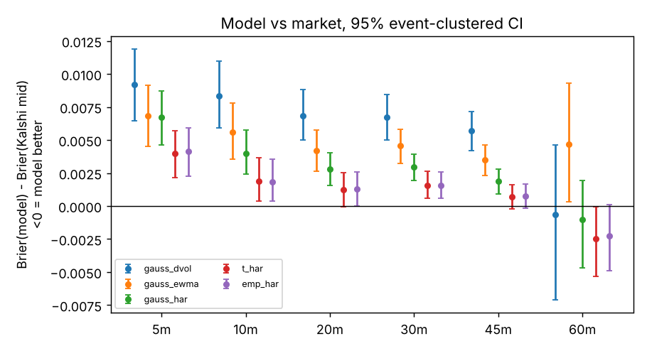
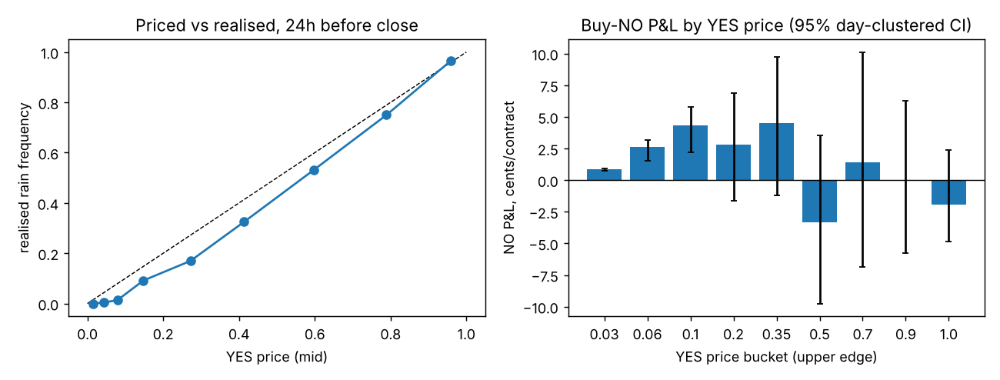

# Prediction-Market Edge Research (Kalshi)

Quantitative research on **prediction-market pricing**: where Kalshi's prices are efficient, where they are not, and whether any gap
survives fees. Every claim is tested on real settled outcomes with event-clustered inference, walk-forward (never in-sample)
evaluation, and, for the leads that survived, pre-registered follow-up tests. **Headline: Kalshi's liquid markets were priced better than every
model I built; taking liquidity loses roughly the spread plus the fee almost everywhere. Null results are reported as null.**

## Key findings

| Question | Answer |
|---|---|
| Can volatility/options models beat Kalshi's hourly BTC ladder? | **No.** The best (Student-t on a realised-vol forecast) trails the market by ~0.002 Brier; trading it loses ~0.6c per contract after fees. No arbitrage inside the strike ladders. |
| "Bet NO on rain, every time"? | **Partly.** The market overprices rain: NO earns +1.4 to +2.5c if bought 6-18h before close; the "YES under 10c" version replicated out of sample (+2.0c). A weather-forecast model scored *worse* than the market. |
| Do simple rules work across 103 recurring series? | **No.** 0 of 736 tests survive false-discovery control plus replication; taker rules lose ~spread + fee (NO on everything: -5.6c). The rain pattern does not generalise. |
| Can ML beat the crowd on mention markets? | **Lift, not edge.** SEC-filing text improves on a per-word base rate (-0.0176 log loss) but Kalshi's price is far sharper (0.477 vs 0.638); sports team/PCA structure adds nothing. |
| Is the "NO on 15-30c words" lead real (pre-registered)? | **Not supported** (-3.1c, p = 0.65 on a new sample). |
| Does a passive maker earn the retail flow's losses? | **Open.** Trade tape: retail-sized YES buyers lose several cents; the live queue-aware paper-trading test has 6 of the 30 settled events its frozen criterion needs. |
| Does an RL market maker beat Avellaneda-Stoikov? | **On mean P&L, yes (4/4 seeds); risk-adjusted, no (Sharpe 6.2 vs 8.7), and brittle out-of-distribution.** |
| Are Kalshi's own bracket-ladder intervals calibrated? (conformal prediction) | **No, they are too wide: nominal 90% sets cover 93%.** Split-conformal and adaptive-conformal recalibration restore 90% with ~6-10% narrower sets. |
| Does knowing *who* bet (Dawid-Skene trader reliability) add information beyond the price? (Manifold, 8.4k markets) | **Barely: log loss -0.0026 at 20 bets [CI -0.0040, -0.0013], not significant at 50 bets; the shuffled-identity null gives ~0.** |

**What makes the results trustworthy:** event-clustered bootstrap (strikes in one event are not independent); walk-forward models;
exact tests where a bootstrap breaks (all-win samples); Benjamini-Hochberg control with replication; pre-registered hypotheses
(`PREREGISTRATION.md`); a simulator-equivalence test for the RL environment. Several early "discoveries" were artifacts and were
caught and fixed (degenerate bootstrap, lifetime leakage in mention markets, a 404 retry bug); the commit history shows each.

## Projects

### 1. `digitaledge`: pricing BTC "above $X" contracts off options and vol models
Kalshi's hourly Bitcoin contracts are digital options. This project prices them from first
principles and scores the result against the market on settled outcomes.
- **Vol models (walk-forward):** HAR-RV with intraday seasonality, EWMA, Deribit DVOL; Gaussian,
  Student-t and empirical tails.
- **Microstructure details:** Kalshi settles on a 60-second average of the index, which shortens
  the effective variance horizon by 2/3 minute; this is modelled explicitly.
- **Options surface:** SVI smile fit to Deribit's live chain; skew-aware digital price
  `N(d2) - vega * d(sigma)/dK`, checked against finite-difference `-dC/dK` and a butterfly
  no-arbitrage test.
- **Inference:** Brier/log-loss with paired cluster-bootstrap by event (strikes in one hour share
  a single outcome, so contracts are not independent).
- **Trading test:** fee-aware backtest (`ceil(0.07 * P * (1-P))` taker fee) with the edge threshold
  chosen on an earlier period and evaluated on a later one; static-arbitrage scan of strike ladders.
- **Forward test:** a collector logs live quotes, the options smile and model prices; settlement
  is joined later, so the options-surface model is evaluated strictly out of sample.

#### Results: 20,354 observations, 468 hourly events (15 Sep - 4 Oct 2026), 95% CIs clustered by event
**Headline (a negative result): Kalshi's hourly BTC ladder is priced better than every volatility
model I built.** Brier(model) minus Brier(market mid), positive = model worse:



| | 10 min to settle | 30 min to settle |
|---|---|---|
| Gaussian + Deribit DVOL | +0.0084 [0.0059, 0.0110] | +0.0067 [0.0050, 0.0084] |
| Gaussian + EWMA | +0.0056 [0.0036, 0.0078] | +0.0046 [0.0032, 0.0058] |
| Gaussian + HAR-RV (walk-forward) | +0.0040 [0.0024, 0.0058] | +0.0030 [0.0019, 0.0039] |
| **Student-t + HAR-RV** | **+0.0019 [0.0004, 0.0037]** | **+0.0016 [0.0006, 0.0026]** |

- **Slow vol is the wrong tool for an hourly contract.** DVOL (a 30-day implied vol) is the worst
  input, then EWMA, then HAR with intraday seasonality; fat tails (Student-t / empirical) beat
  Gaussian at every horizon.
- **The edge is not tradeable.** Walk-forward fee-aware trading of the best models: +0.1c per
  contract before cent-rounding, **-0.6c after** (CI spans zero); the Gaussian models lose
  1.4-3.2c [CIs below zero].
- **No static arbitrage.** 1 monotonicity violation across 20k quotes, gross 1c, negative net.
- **Where the market wins:** near the money (|distance to strike| < 1 model sigma: gap +0.003,
  CI above zero) and in US trading hours (12-17 UTC: +0.0023 [0.0010, 0.0037]); far from the
  strike the model and market agree (|z| > 1.5: gap ~ 0). The gap also grows as settlement
  approaches (largest at 5 min, ~0 at 45 min), pointing to real-time information.
- **A hypothesis I tested and mostly rejected:** that the market simply has a better spot
  (Kalshi settles on the multi-exchange CF BRTI; I use Coinbase). The ladder-implied center sits
  only ~$4 above Coinbase (+0.03-0.05 sigma). Correcting spot by a walk-forward estimate of that
  basis closes only **5-7%** of the gap, so most of the market's near-the-money edge is
  unexplained (candidates: time-varying index noise, order-flow/momentum information).

Caveats: 20 days, one regime; few observations 60 min out (markets open about an hour before
settlement); the zero-drift martingale assumption ignores BTC's realised drift in the window.
The skew-aware options-surface model cannot be tested on history (no free historical option
surfaces) and is being evaluated forward by the collector.

### 2. Recurring markets: is there an edge in "bet NO on rain, every time"?
Kalshi lists a daily "will it rain in <city>?" market for ~20 US cities (YES if measured
precipitation is strictly above 0 in). `recurring.py` / `rain_study.py` test:
- the naive always-NO rule, by lead time, price bucket and city, net of fees;
- calibration by price (favorite-longshot bias, documented for Kalshi by
  [Whelan 2025](https://www.karlwhelan.com/Papers/Kalshi.pdf));
- a walk-forward forecast model built from *as-of* archived weather forecasts (Open-Meteo
  previous-runs, so no hindsight) against the market price.

#### Results: 1,754 settled markets, 78 days (Jul-Oct 2026), ~20 cities, 95% CIs clustered by day
Rain happened in 23.7% of city-days. Entry prices are Kalshi's quote at the stated time before
close (the climate day starts 24h before close); P&L is one contract bought at the ask, net of the
taker fee `0.07*P*(1-P)`.



| Finding | Evidence |
|---|---|
| **The market overprices rain.** | Realised frequency sits below the 45-degree line at almost every price level. At the 24h mark, a YES priced 4-8c rained 0.4-1.3% of the time. |
| **"Always buy NO" is only conditionally true.** | Entered 6-18h before close: +1.4 to +2.5c/contract (CI above zero, e.g. 18h: +2.5c [1.2, 3.7]). Entered 24h before close: +1.4c [0.0, 2.7], borderline. Entered 30-42h before close it **loses** (-4.4c [-6.5, -2.2] at 42h). |
| **The longshot version replicates out of sample.** | Rule "buy NO at day start when YES < 10c", chosen on days 1-39: +1.9c [1.1, 2.4]. Same rule on the held-out days 40-78: **+2.0c [1.3, 2.5]**. The unfiltered "NO on everything" rule at day start is *not* significant in either half (+1.4c [-0.6, 3.3] / +1.3c [-0.5, 3.2]). |
| **It is a pricing quirk, not better forecasting.** | A walk-forward model from *as-of archived* weather forecasts plus city climatology is clearly worse than the market (Brier 0.129 vs 0.086; paired gap +0.042 [0.031, 0.054]) and loses ~1.5c/contract if traded. |

Why a thin edge is not a business: it is ~1-2c on a ~75c contract, and the P&L stream (one NO per
city per day, entered 12h before close) has a daily mean of +$0.41 with a standard deviation of
$0.97 and winning days only 64% of the time; each loss costs ~75c, so it is
"picking up pennies" with a fat left tail. Per-market volume is thousands of contracts, so capacity
is small. With cent-rounded fees on 1-lot orders the edge shrinks by ~0.5c.

**Caveats:** one 78-day window (summer to early autumn) and no winter data; many lead-time and price
cuts were examined (the replication across halves, not any single CI, is the evidence);
fills at the quoted ask are assumed, and depth at the quote is not observed in hourly candles;
quotes older than 3h are dropped. Reproduce with `python scripts/rain_report.py`
(raw numbers in `results/rain_results.json`).

### 3. Breadth screen: do simple rules work across *all* recurring Kalshi markets?
`screen.py` takes 103 daily/weekly/hourly series (weather, economics, commodities, financials,
crypto, entertainment; ~35,700 quotes, ~4,300 events, last ~60 days), buys one contract at the
ask under four simple rules at three points in each market's life (50/80/95% elapsed), and
tests every (series x entry x rule) with each series' own fee multiplier.

**Result: nothing survives.** 736 tests over 88 series; with event-clustered inference,
Benjamini-Hochberg FDR control at 5%, and replication in a held-out half of each series' history,
**0 discoveries**. Pooled by rule (cents per contract, 95% CI clustered by close date):

| Rule | All series | Weather | Economics | Financials |
|---|---|---|---|---|
| Buy NO on everything | **-5.6** [-6.1, -5.1] | -4.3 | -5.4 | -12.9 |
| Buy YES on everything | -3.2 [-3.8, -2.7] | -2.4 | -5.4 | -1.0 (n.s.) |
| Buy YES when priced > 90c | -0.9 [-1.5, -0.4] | -0.1 (n.s.) | +0.1 (n.s.) | n/a |
| Buy NO when YES priced < 10c | -1.6 [-2.0, -1.3] | -1.2 | -0.6 (n.s.) | -6.4 |

- **Taking liquidity at the ask loses roughly the spread plus the fee.** The average quoted spread
  is 7.8c (5.7c in weather); cheap contracts have ~2c spreads, and fees add up to 1.75c at 50c.
- **The rain result does not generalise.** Longshot-NO earned +2c on rain (above) but loses 1.2c
  pooled over 59 weather series, so it is a property of that market, not of Kalshi.
- **Two statistical traps I hit and fixed (both in the commit history):** (1) with only a few
  independent events per series, a cluster bootstrap is degenerate and produced 105 spurious
  "discoveries"; the screen now requires >= 25 events and clusters by event. (2) For
  "favorite at 98c" rules every sampled contract wins, the bootstrap reports zero variance and
  certainty; an exact binomial test at the event level replaced it (45 straight wins at 98c is
  not evidence: 0.98^45 = 40%).
- **What this cannot rule out:** edges of 1-2c at high prices (too few events per series to
  detect), anything on the *maker* side (this tests taking only), and behaviour outside the last
  ~60 days. Raw results: `results/screen_results.csv`, `results/screen_pooled.csv`.

### 4. Mention markets: can ML (incl. low-rank / PCA structure and SEC filing text) beat the crowd?
Kalshi's Mentions category is ~50,000 settled "will X say WORD during EVENT?" markets (earnings calls,
sports broadcasts, press briefings; tens of millions of dollars traded). Data is sparse per company or team, so I tested
whether models that borrow strength can predict which words get said. All evaluations are walk-forward:
features for an event use only events that had *already settled* before it opened (mention markets close
early on YES, so market lifetime leaks the outcome and is never used; prices are taken at a fixed pre-event time).

**Sports announcer markets (539 games, 6 leagues): a null.** A per-word base rate is already strong
(log loss 0.568 vs 0.669 for the series-wide rate), but team-by-word effects and a rank-3 SVD (PCA) smoothing of the
team x word residual matrix add only -0.0014 log loss (95% CI [-0.0042, +0.0012]); gradient boosting overfits (+0.010).
With 30-100 games per series the latent structure is too sparse to learn (`scripts/mentions_sports_experiment.py`).

**Earnings calls (350 calls, 147 companies, 4,708 word-markets): real lift over a base rate, but the market is far sharper.**
Features: each word's count in the company's most recent 10-Q/10-K (SEC EDGAR, filed before the market opened),
a shrunk word prior and company "talkativeness" from earlier settled calls.

| Model (walk-forward) | Log loss | vs per-word base rate (95% CI, clustered by call) |
|---|---|---|
| Per-word base rate | 0.6600 | n/a |
| Word + company prior | 0.6629 | +0.0029 [-0.0008, +0.0066] |
| **+ SEC filing word counts (logistic)** | **0.6424** | **-0.0176 [-0.0257, -0.0097]** |
| Gradient boosting, same features | 0.6469 | -0.0131 [-0.0212, -0.0045] |

The filing text carries real company-specific information that outcome history lacks. **But it is not an edge:**
against Kalshi's own price 8 hours before the call (3,069 word-markets, 230 calls, average spread 3.6c):
- **Accuracy:** market log loss 0.477 vs model 0.638 (gap +0.16, CI [0.14, 0.18]). The market is better in every
  liquidity tercile, including the thinnest (0.37 vs 0.57), so I could not find a pocket where it is less informed.
- **Adds information beyond the market?** Walk-forward stacking of market and model: -0.0032 log loss
  [-0.0091, +0.0028], not significant.
- **Fee-aware trading, threshold chosen on the first half and tested on the second:** -2.2c per contract
  [-4.6, +0.4] for the model; +0.7c [-5.2, +6.2] for the stacked model (n=320, exact p=0.56).
- **A pattern worth testing prospectively, not claiming:** the market looks mildly over-priced on YES for words
  priced 15-30c (realised 15% vs 22% priced; buying NO +4.1c [0.7, 7.3]), but that is one of eight price buckets
  on one season, so it needs a forward test (pre-registered rule, next earnings season).
Scripts: `scripts/earnings_experiment.py`, `scripts/earnings_vs_market.py`; results in `results/earnings_*`.

#### Pre-registered follow-up: is the "NO on 15-30c words" pattern real? (`PREREGISTRATION.md`)
The earnings pattern was one of eight price buckets on one season, so it was frozen as a hypothesis (committed before
any test-sample prices were looked at) and tested on data it was not found in. One rule, one test per sample:

| Test | Sample | Result |
|---|---|---|
| **H1b** | 213 non-earnings mention contracts (sports, politics, TV; 79 events; Aug-Oct 2026) | **Not supported:** -3.1c per contract, 95% CI [-9.1, +2.5], exact p = 0.65. Realised YES 21% vs 23% priced; the 2-point overpricing is smaller than spread + fee. |
| **H1a** | Earnings calls dated on/after 2026-10-08 (prospective) | Pending. Only ~100-150 qualifying contracts will accrue this season, so the decision waits for 300 (`scripts/prereg_h1a.py`). |

Caveat on H1b: only 1,297 of 5,792 markets had a quote within 30 minutes of opening (22%), so it covers actively quoted
markets. Conclusion so far: the earnings pattern does not generalise to other mention markets, and I am not claiming it.

#### Exploratory: who loses money in mention markets? (trade tape, `digitaledge/tape.py`)
Trading is zero-sum before fees, so the maker side's gross P&L on every trade is exactly the negative of the taker's.
Using all 428,000 trades in the 400 most liquid non-earnings mention markets (28M contracts, 62 events, Aug-Oct 2026),
volume-weighted, event-clustered 95% CIs, fee 0.07 p (1-p) charged to takers:

- Liquidity providers earned about **+0.8c gross per contract** [-0.3, +1.8] (not significant on 62 events).
- **Retail-sized takers (under 20 contracts) lost -3.1c gross** [-5.5, -1.1] vs -0.4c for large takers [-1.4, +0.9].
- Retail-sized **YES buyers lose at nearly every price**: -5.6c at 5-15c [-8.2, -1.9], -8.2c at 15-30c [-14.1, -1.9] after fees.
- Lottery tickets: 9M contracts of YES bought at <= 5c lost -1.8c [-2.0, -1.6]; buying NO at those prices earned +1.35c [+0.9, +1.7] after fees.

**Not an edge claim.** This is a tape I had already looked at, so these are leads. They are realised trade prices; the
pre-registered quote-based test (H1b) found nothing for a taker buying NO at the posted ask. The profit most plausibly belongs
to whoever *provides* liquidity to this flow, which depends on queue priority and cancellations that need order-book data to test.

#### Exploratory: can ML pick the safe fills for a maker? (`scripts/toxicity_model.py`): no
For a maker selling YES at price p, P&L is p - y. On the 143,840 taker-YES trades priced 3-40c in the tape (5.4M contracts, 60 events),
a gradient-boosted model predicted y from strictly past market activity (price, trade size, 10-minute price momentum, flow imbalance,
volume, market age), 5-fold CV grouped by event. **It added nothing:** out-of-fold AUC 0.848 vs 0.876 for the price alone.
Accepting only the fills the model rated positive-EV moved maker P&L from +2.44c [-0.42, +5.16] to +2.86c [+0.24, +5.35] per contract
(overlapping, and no better than a price rule). The descriptive result stands: the passive side of small-trade (<20 contracts) flow earned
+5.1c per contract [+1.3, +9.1]. Exploratory, ex-post on a tape already examined, and silent on queue priority, which is what the live test measures.

#### In progress: paper-trading a passive NO bidder with a queue model (`PREREGISTRATION.md`, addendum H2)
The tape shows retail YES buyers lose; the open question is whether a *new* maker would actually get those fills. Kalshi's order
book is public, so `scripts/book_collector.py` snapshots the book and records trades for the ~30 most active live mention markets
every 45 seconds, and `scripts/paper_maker.py` replays a frozen rule: rest 1 NO behind the displayed queue, fill only when
enough taker-YES volume trades through the queue ahead, mark to the settled outcome (P&L = ask - outcome, no maker fee). The rule,
statistic and decision criterion were committed before any data was collected (commit `4079cbc`): supported only with >= 30 settled events
and a clustered 95% CI above zero. No result yet; the queue logic has unit tests (`tests/test_papermaker.py`).

### 5. `mmsim`: market making under adverse selection, and an RL market maker
Hawkes-process order flow with price impact (buys and sells cluster; each order moves the mid), Avellaneda-Stoikov (A-S) quoting, and an
intensity-aware extension, all evaluated on common random numbers (every strategy trades the identical simulated paths) and validated against
analytic fill rates.

**RL market maker (`mmsim/rl.py`, `scripts/rl_mm_experiment.py`): a reproduction of the approach in Spooner et al. (2018).** Linear Q-learning
over tile-coded state (inventory, time, buy/sell excitation), actions = (bid, ask) distances, asymmetrically dampened P&L reward, numpy only. A test
checks that the RL environment reproduces the validated simulator's P&L exactly for a fixed policy. Five agents (seeds 0-4), 3,000 training episodes
each, evaluated on 400 held-out paths per regime (seed 0 uses its final checkpoint, seeds 1-4 the best-validation checkpoint):

| In-distribution (same flow as training) | Mean P&L | Sharpe | Inventory sd |
|---|---|---|---|
| Fixed 2-tick spread | 526.3 | 3.40 | 5.4 |
| Avellaneda-Stoikov | 479.7 | **8.72** | 1.5 |
| Hawkes-aware A-S (this repo) | 506.2 | **8.81** | 1.4 |
| **RL agent** (mean of seeds 1-4) | 511.9 | 6.23 | 2.6 |

- The RL agent beats A-S on mean P&L in **4/4 seeds** (+17.6 to +52.3 ticks per path, every paired 95% CI above zero), but loses on Sharpe in **4/4**: it
  earns more by holding more inventory risk. The intensity-aware A-S baseline beats every RL seed on risk-adjusted terms.
- **Out-of-distribution** (stronger clustering, impact and volatility than in training): inconsistent across seeds (+66, +7, -60, +15 ticks vs A-S; only one
  of four clearly better) and Sharpe is below A-S in 4/4 (1.06 vs 2.50), while the intensity-aware A-S stays best (+64.7 ticks).
- The validation curve is non-monotone (peaks near episode 1,800 then drifts down for seed 0), which is why later runs checkpoint on validation P&L.
- **A per-step inventory penalty does not close the Sharpe gap** (seed 1, penalty phi in {0.0005, 0.002, 0.005, 0.01}, checkpoints chosen on validation
  Sharpe): Sharpe stays at 7.1-7.5 vs 7.2 unpenalised and 8.72 for A-S; mean P&L vs A-S wanders between -8 and +19 ticks non-monotonically, so seed and
  checkpoint noise dominates the effect. Out-of-distribution Sharpe stays ~1.4 vs 2.5 for A-S. One seed per setting: a pointer, not a proof.
- Limits: stylised flow, one reward shape and no hyperparameter tuning (a stronger inventory penalty would trade mean for risk), so this shows
  the *failure modes* of the method here, not that RL cannot work.

### 5b. Conformal prediction on market-implied distributions (`digitaledge/conformal.py`, `scripts/conformal_study.py`)

Not a trading strategy. A bracket ladder (e.g. "high temp 77-78 F", "79-80 F", plus tails) is a predictive distribution over a numeric
settlement value. I build its CDF from mid prices (overround removed by normalising), take the probability integral transform (PIT) of
the realised outcome (randomised within the resolved bin), and ask a distribution-free question: **do the market's own central
intervals contain the outcome at their stated rate?** Then I wrap the same distributions in split conformal prediction and in Adaptive
Conformal Inference (Gibbs & Candes, 2021), which is built for distribution shift and is evaluated online in time order.

Data: 796 / 747 / 664 fully priced ladders at 24h / 6h / 1h before close (daily temperature brackets and a few nested
"above X" ladders across the screen's series), priced at the last quote at least H hours before close. Coverage is averaged over 50
PIT randomisations; CIs bootstrap over events. Split conformal calibrates on the first 40% of events (time-ordered) and is tested on the rest.

| Horizon | Market nominal | Actual coverage of the market's 90% set | Split conformal | ACI (online) | Width vs market set |
|---|---|---|---|---|---|
| 24h | 90% | 92.6% [90.8, 94.2] | 89.7% [87.7, 91.5] | 89.8% [88.3, 91.2] | about x0.90 |
| 6h  | 90% | 92.7% [91.9, 93.4] | 89.6% [88.5, 90.5] | 90.0% [89.3, 90.7] | about x0.94 |
| 1h  | 90% | 93.3% [92.5, 93.9] | 90.3% [89.5, 91.0] | 90.1% [89.5, 90.7] | about x0.94 |

- **The market is slightly overdispersed** (its intervals are conservative): tail mass beyond the 5th/95th PIT percentiles is 6.5-6.9% against 10% if calibrated, at every horizon. Consistent with a favourite-longshot pattern in which cheap tail brackets are priced too high. That mechanism is a hypothesis; I have not tested it (e.g. by repricing tails from bids instead of mids).
- **Conformal recalibration fixes coverage and tightens the sets by about 6-10%**, so the information in the ladder is slightly underused rather than wrong. ACI matches the target online without a held-out calibration block.
- **Conditional coverage is uneven across series:** at 90% the per-series split-conformal coverage ranges from about 0.73-0.87 up to 0.94-1.00 (median ~0.9, series with at least 8 test events), so the marginal guarantee does not carry over to each city.
- Limits: mostly daily-temperature ladders from one summer-to-autumn window, and a 40/60 split of a short sample, so this says nothing about other seasons or other market types. The effect is real but small; it is a calibration finding, not an edge.

### 5c. Trader reliability from bets (`crowdskill/`, `scripts/crowdskill_study.py`): Dawid-Skene on Manifold Markets

A different venue and dataset from everything above (public Manifold Markets API, 8,493 resolved YES/NO binary markets with 20-400 bettors,
created roughly Mar 2024 - Oct 2026). Idea from crowd-labelling (Dawid & Skene, 1979): treat each bettor's net direction in a market as a
noisy vote on the eventual outcome, learn each bettor's confusion matrix from resolved markets, and ask whether the weighted votes carry
information the price does not already contain.

- **Vote** = sign of a bettor's net stake in the first K bets (K = 20 or 50); **anchor price** = price after the K-th bet.
- **Evidence** = sum over voters of log P(vote | YES) / P(vote | NO) from Dirichlet-smoothed per-bettor counts, using only markets that had
  already *resolved before the anchor time* (a prequential replay, no look-ahead; unit-tested).
- **Aggregator** = logistic regression on logit(price) and evidence. Trained on the first 60% of anchors whose labels resolved before the test window; tested on the last 40%.
- **Null** = within each market, randomly reassign the observed votes among its voters (a plain relabelling of user ids would be a no-op, which my first null mistakenly was; it gave identical numbers, and I fixed it).

| K | markets (test) | Price | Price recalibrated | + evidence | Δ log loss vs recalibrated price [95% CI, bootstrap over markets] | Same with shuffled votes |
|---|---|---|---|---|---|---|
| 20 | 8,416 (3,367) | 0.5791 | 0.5730 | **0.5704** | **-0.0026 [-0.0040, -0.0013]** | -0.0002 [-0.0004, +0.0000] |
| 50 | 5,672 (2,269) | 0.4590 | 0.4577 | 0.4575 | -0.0002 [-0.0016, +0.0012] | +0.0001 [-0.0000, +0.0001] |

- Early in a market's life (20 bets), who is betting carries a small amount of genuine information: the improvement is about 0.4% of log loss and vanishes under the shuffled-votes null. By 50 bets the price has absorbed it and the gain is statistically zero.
- Most of the early gain over the raw price is simply **recalibration**: the fitted slope on logit(price) is 0.85 at K = 20, i.e. early Manifold prices are overconfident, and shrinking them helps more than the bettor evidence does.
- Limits: markets are required to have at least K bets (selection on future activity), one time split, a single venue with play money, and no per-bettor staking or market-category structure. This is a measurement of how much reliability information exists, not a forecasting product.

### 6. `quantlab`: bias-aware backtesting toolkit
Look-ahead-safe engine, walk-forward validation, Probabilistic/Deflated Sharpe.

## Status
Complete: BTC digitals, rain, 103-series screen, mention-market ML, RL market maker. In progress: the pre-registered queue-aware paper-trading test
(`PREREGISTRATION.md`, addendum H2; collector in `scripts/book_collector.py`, results via `scripts/paper_maker.py`) and the earnings forward test (H1a,
`scripts/prereg_h1a.py`). Both need weeks of data; interim numbers are explicitly non-decisive.

## Run it
```bash
git clone https://github.com/skandra08/temporary-kalshi && cd temporary-kalshi
bash scripts/setup_local.sh                     # venv + dependencies + 56 tests
source .venv/bin/activate
export EDGAR_UA="kalshi-edge-research you@example.com"   # SEC asks for a contact in the User-Agent
python -m digitaledge study --start 2026-09-15 --end 2026-10-05   # BTC digitals study
python scripts/rain_report.py                   # rain study (needs data/rain_*.csv from digitaledge.recurring)
python scripts/earnings_experiment.py           # earnings-call mention markets + SEC filing text
python scripts/mentions_sports_experiment.py    # announcer-mention markets (team / low-rank models)
python scripts/rl_mm_experiment.py --episodes 3000 --keep-best   # RL market maker vs Avellaneda-Stoikov
bash scripts/start_collection.sh ~/temporary-kalshi 336         # live order-book collector + archive loop (weeks)
python scripts/paper_maker.py data_live         # apply the frozen paper-trading rule to what was collected
```
Every Kalshi and SEC response is cached under `data/`, so runs are resumable. First pulls are slow (Kalshi and SEC rate limits; the
earnings run downloads about 1 GB of filings).

## Layout
```
digitaledge/  data sources, vol models, digital pricing, SVI, scoring, backtest, screen, mention/earnings models, tape, paper-maker, collectors
mmsim/        Hawkes market-making simulator, strategies, RL agent
quantlab/     bias-aware backtesting toolkit
tests/        56 tests, all offline (synthetic data with known ground truth)
scripts/      reproducible experiments, collectors, local setup
results/      tables, figures and raw numbers behind every claim above
PREREGISTRATION.md   hypotheses frozen before testing (H1a/H1b, H2 + amendment)
```
